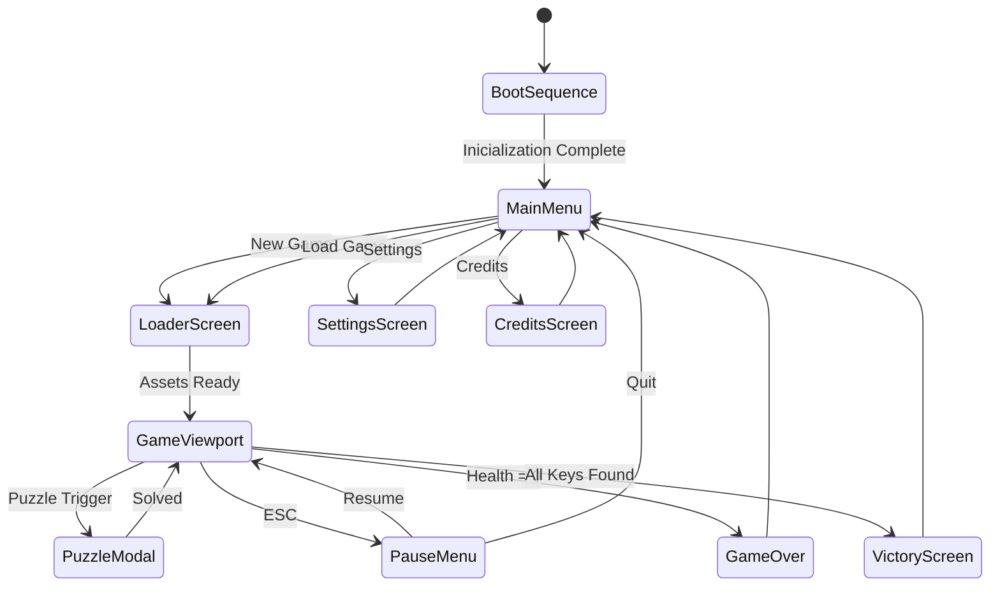
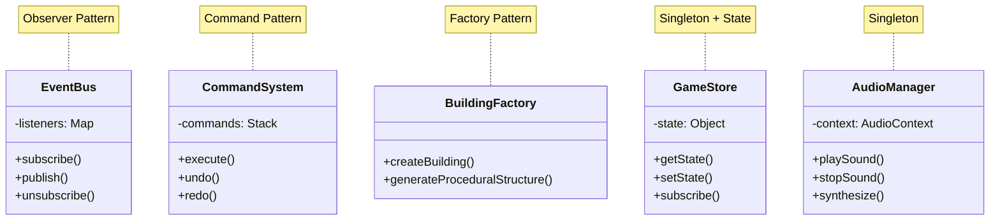
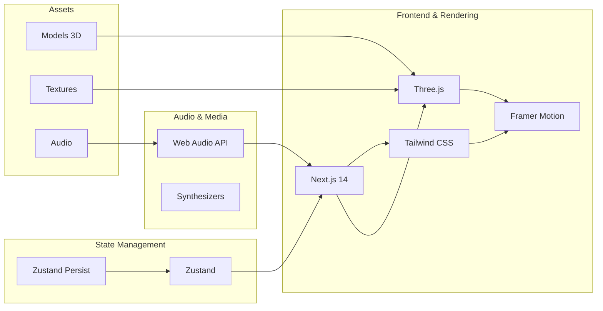
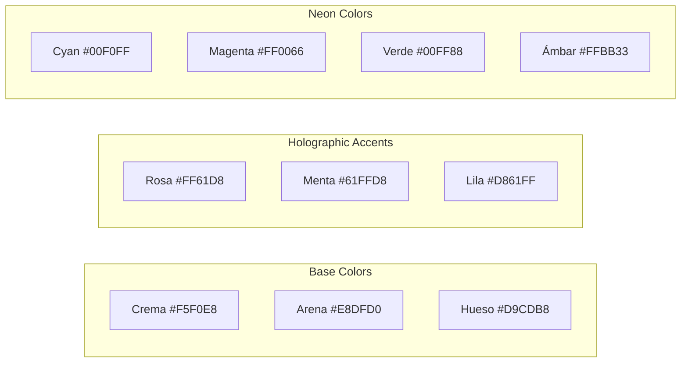
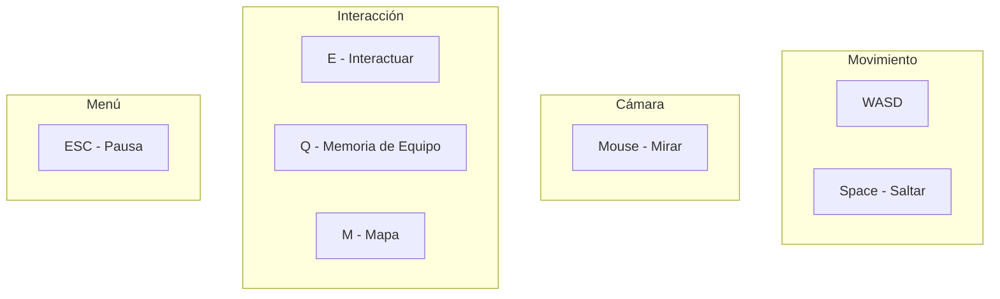
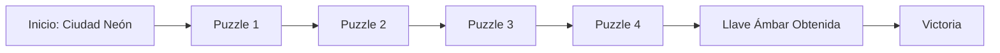

# OASIS: La Última Clave — Las 5 Llaves de Halliday

> Juego 3D narrativo cyberpunk con estética crema/holográfica.
> Built with **Next.js 14 + Three.js + Tailwind CSS + Zustand**

---

## Descripción

Eva es la última jugadora en el OASIS. Sus compañeras fueron
eliminadas permanentemente por el Protocolo Veneno_Zagar. Ahora Eva debe
encontrar las 5 llaves de Halliday sola, atravesando mundos corruptos
mientras el sistema se desmorona a su alrededor.

## Arquitectura del Proyecto

```mermaid
graph TD
    A["src/"] --> B["app/"]
    A --> C["components/"]
    A --> D["constants/"]
    A --> E["lib/"]
    A --> F["patterns/"]
    A --> G["styles/"]
    
    B --> B1["layout.js"]
    B --> B2["page.js"]
    B --> B3["api/auth/"]
    
    C --> C1["game/"]
    C --> C2["ui/"]
    C --> C3["effects/"]
    
    C1 --> C1A["GameApp.js"]
    C1 --> C1B["GameViewport.js"]
    C1 --> C1C["GameLoop.js"]
    C1 --> C1D["WorldBuilder.js"]
    C1 --> C1E["HudOverlay.js"]
    
    C2 --> C2A["MainMenu.js"]
    C2 --> C2B["LoaderScreen.js"]
    C2 --> C2C["SettingsScreen.js"]
    C2 --> C2D["CharactersScreen.js"]
    C2 --> C2E["PuzzleModal.js"]
    C2 --> C2F["VictoryScreen.js"]
    C2 --> C2G["GameOverScreen.js"]
    
    C3 --> C3A["HolographicOverlay.js"]
    
    D --> D1["gameConstants.js"]
    E --> E1["gameStore.js"]
    E --> E2["audioManager.js"]
    E --> E3["database.js"]
    
    F --> F1["EventBus.js"]
    F --> F2["CommandSystem.js"]
    F --> F3["BuildingFactory.js"]
    
    G --> G1["globals.css"]
```



## Flujo del Juego



## Patrones de Diseño



## Stack Tecnológico



## Paleta Visual



## Instalación

```bash
# 1. Instalar dependencias
npm install

# 2. Ejecutar en modo desarrollo
npm run dev

# 3. Abrir en navegador
# http://localhost:3000
```

## Controles de Juego



## Nivel 1: Las Cenizas de la Ciudad



**Características del Nivel:**
- Mundo: Ciudad Neón, Zona de Duelo
- Sistema de corrupción que avanza con el tiempo
- Memoria de Equipo (ecos de Suyin y Zuri) que ralentiza la corrupción
- 4 puzzles para resolver

## Sistema de Audio

**Generación procedural con Web Audio API:**
- Drones oscuros cyberpunk para atmosfera
- Efectos de boot/arranque para UI
- Sonidos de glitch durante corrupción
- Melodías para puzzle resuelto
- Melodías para llave obtenida

## Licencia

Proyecto educativo — Diseño de Interfaces 2025
